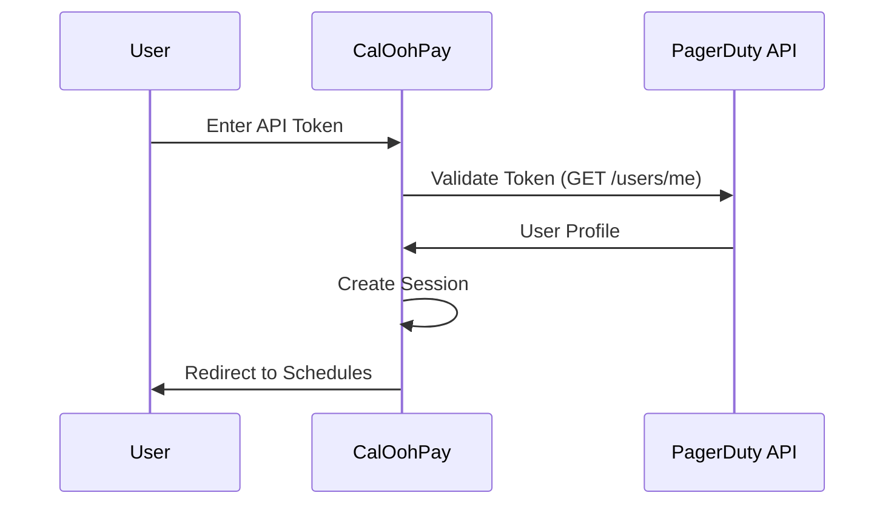

# API Token Authentication Guide

## Overview

CalOohPay Web now supports two authentication methods:

1. **OAuth 2.0** - Full OAuth flow with PagerDuty (requires OAuth app setup)
2. **API Token** - Simple authentication using PagerDuty User API Token (no OAuth app needed)

## Why Use API Token Authentication?

API Token authentication is ideal when:

- ✅ You want a simpler setup without OAuth configuration
- ✅ You don't want to create a PagerDuty OAuth application
- ✅ You're testing the application locally
- ✅ You're the only user of the application

OAuth authentication is recommended when:

- ✅ You're deploying for multiple users
- ✅ You want automatic token refresh
- ✅ You want to avoid managing individual API tokens

## Getting Your PagerDuty User API Token

### Step 1: Log into PagerDuty

Navigate to your PagerDuty account and sign in.

### Step 2: Access User Settings

1. Click on your **user icon** in the top-right corner
2. Select **My Profile** from the dropdown menu

### Step 3: Navigate to User Settings

1. Click on the **User Settings** tab
2. Scroll down to the **API Access** section

### Step 4: Create or Copy API Token

1. If you don't have a token, click **Create API User Token**
2. Give it a description like "CalOohPay Web Access"
3. **Copy the token** and save it securely

> ⚠️ **Important**: Treat your API token like a password. Never share it or commit it to version control.

## Using API Token to Sign In

### Step 1: Navigate to Login Page

Go to the CalOohPay Web login page at `http://localhost:3000/login`

### Step 2: Select API Token Tab

Click on the **API Token** tab in the login interface.

### Step 3: Enter Your Token

1. Paste your PagerDuty User API Token into the input field
2. Click **Sign in with API Token**

### Step 4: Access Your Schedules

Upon successful authentication, you'll be redirected to the schedules page with full access to your PagerDuty data.

## How It Works

### Authentication Flow



### Technical Details

1. **Token Validation**: When you enter your API token, CalOohPay validates it by calling the PagerDuty API (`/users/me` endpoint)
2. **Session Creation**: Upon successful validation, a JWT session is created with your user information
3. **Token Storage**: Your API token is securely stored in the encrypted session
4. **API Calls**: All subsequent PagerDuty API calls use your token with the format: `Authorization: Token token=YOUR_TOKEN`

### Security

- ✅ Tokens are stored in encrypted HTTP-only session cookies
- ✅ Tokens are never exposed to client-side JavaScript
- ✅ Sessions use the same 30-day expiration as OAuth sessions
- ✅ Token validation happens server-side only

## Comparison: OAuth vs API Token

| Feature                | OAuth 2.0                   | API Token                                  |
| ---------------------- | --------------------------- | ------------------------------------------ |
| **Setup Complexity**   | Requires OAuth app creation | No setup required                          |
| **User Experience**    | Single click sign-in        | Manual token entry                         |
| **Token Refresh**      | Automatic                   | Manual (no expiration for User API tokens) |
| **Multi-user Support** | Excellent                   | Limited (each user needs own token)        |
| **Revocation**         | Via PagerDuty OAuth apps    | Via PagerDuty user settings                |
| **Best For**           | Production deployments      | Development & personal use                 |

## Troubleshooting

### "Invalid API Token" Error

**Symptoms**: Error message when trying to sign in with API token

**Solutions**:

1. Verify you copied the entire token (no extra spaces)
2. Ensure the token is a **User API Token**, not a REST API Key
3. Check that your PagerDuty account has appropriate permissions
4. Try creating a new API token in PagerDuty

### Token Works But Can't Access Schedules

**Symptoms**: Successfully authenticated but no schedules appear

**Solutions**:

1. Verify your PagerDuty user has access to schedules
2. Check that schedules exist in your PagerDuty account
3. Review browser console for API errors
4. Ensure your user has the required permissions in PagerDuty

### Session Expires Immediately

**Symptoms**: Logged out right after signing in

**Solutions**:

1. Check that `NEXTAUTH_SECRET` is set in your `.env.local`
2. Generate a new secret: `openssl rand -base64 32`
3. Clear browser cookies and try again

## Environment Variables

No additional environment variables are required for API Token authentication. The existing NextAuth configuration handles both methods:

```env
# NextAuth Configuration (required for both methods)
NEXTAUTH_URL=http://localhost:3000
NEXTAUTH_SECRET=your_generated_secret

# OAuth Configuration (optional if only using API tokens)
NEXT_PUBLIC_PAGERDUTY_CLIENT_ID=your_client_id
PAGERDUTY_CLIENT_SECRET=your_client_secret
```

## Migration Guide

### From OAuth-Only to Dual Authentication

If you're adding API Token support to an existing OAuth deployment:

1. **Update dependencies**: Ensure you have the latest code
2. **No configuration changes needed**: API Token auth works alongside OAuth
3. **Inform users**: Let users know they can now use either method
4. **Test both flows**: Verify OAuth still works and API Token works

### From API Token to OAuth

If you want to migrate users from API tokens to OAuth:

1. **Create PagerDuty OAuth app** (see [OAuth Setup Guide](./pagerduty-oauth-setup.md))
2. **Configure environment variables** with OAuth credentials
3. **Inform users**: Direct them to use the OAuth tab on login page
4. **Optional**: Hide API Token tab by modifying login page

## API Reference

### Authentication Providers

#### OAuth Provider (`pagerduty`)

```typescript
await signIn('pagerduty', {
  callbackUrl: '/schedules',
});
```

#### API Token Provider (`pagerduty-token`)

```typescript
await signIn('pagerduty-token', {
  apiToken: 'YOUR_PAGERDUTY_API_TOKEN',
  callbackUrl: '/schedules',
  redirect: false,
});
```

## Security Best Practices

1. **Never commit tokens**: Add `.env.local` to `.gitignore`
2. **Rotate tokens regularly**: Create new tokens periodically in PagerDuty
3. **Use environment-specific tokens**: Different tokens for dev/staging/prod
4. **Monitor token usage**: Check PagerDuty audit logs for API access
5. **Revoke unused tokens**: Remove old tokens from PagerDuty settings
6. **Use OAuth for production**: Prefer OAuth for multi-user deployments

## Support

For additional help:

- Review the [NextAuth Configuration Guide](../configuration/nextauth-setup.md)
- Check [PagerDuty API Documentation](https://developer.pagerduty.com/docs/rest-api-v2/authentication/)
- Create a [GitHub Issue](../../issues) with your question

---

**Next Steps:**

- [Quick Start Guide](../../QUICK_START.md)
- [OAuth Setup Guide](./pagerduty-oauth-setup.md)
- [Contributing Guide](../contributing/getting-started.md)
